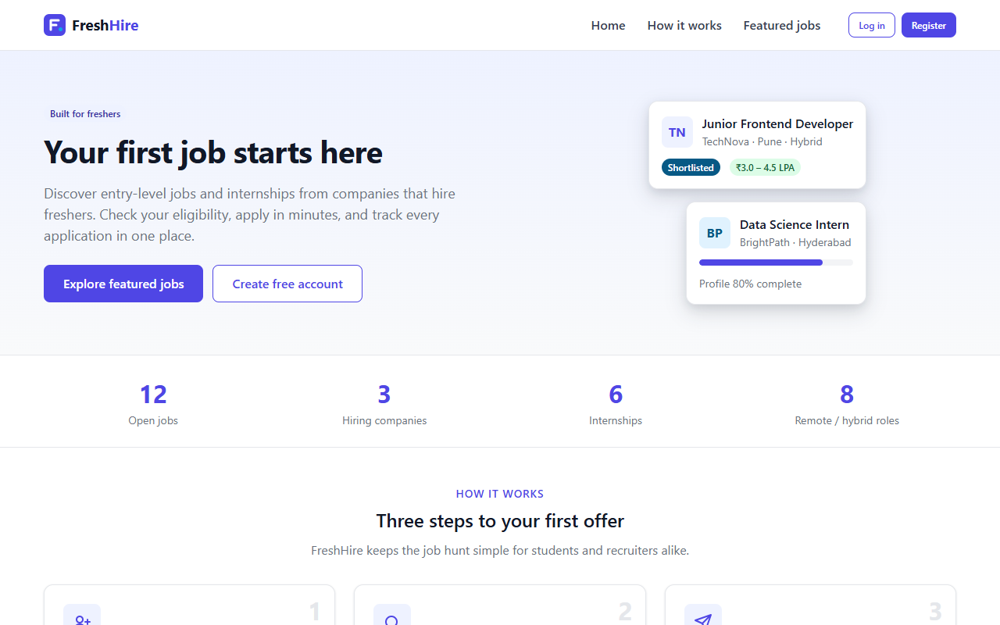

# FreshHire

**A simulated job portal for freshers — final-year college project.**

> ⚠️ **FreshHire is a FRONTEND-ONLY project.**
> It is built entirely with HTML5, CSS3 and Vanilla JavaScript (ES6+ modules). Demo data comes from JSON files and
> is kept in the browser's `localStorage`; the login session lives in `sessionStorage`.
> There is **no backend, no database and no API server**. Login, approvals, notifications and every other
> "server" behaviour are **simulated in the browser**.



---

## Project Status

Phases 0–12 and 14 are complete. **Phase 13 (Testing & QA) was stopped before its final write-up**, so the project
is not marked final — see [PROJECT_STATUS.md](PROJECT_STATUS.md) for the exact state and test results.

## What is FreshHire?

FreshHire helps **freshers** (final-year students and recent graduates) find entry-level jobs and internships,
apply to them and follow their applications. Recruiters post jobs and review applicants; an admin approves
recruiters and jobs and keeps the platform in order.

**Why it was built:** to show a complete, multi-role web application — registration, login, role-based pages,
search, applications, moderation, notifications and analytics — using only client-side web technologies, with a
clean, responsive and accessible interface.

## Features by role

| Role | What they can do |
|---|---|
| **Student** | Register and log in · dashboard (stats, profile completeness, recent applications and updates, recommended jobs, application-status chart) · browse jobs with search, filters (location, type, work mode, pay, skills), sort and pagination · job details with an eligibility check · apply with an optional cover note · save / unsave jobs · My Applications with status filter, timeline and withdraw · profile (personal, education, skills, projects & links) · PDF resume upload (≤ 500 KB) and a printable resume · notifications |
| **Recruiter** | Register (account starts **pending**) · after admin approval: dashboard with stats, recent applicants, applicants-per-job chart and application funnel · post jobs (sent to the admin as pending) · edit and close own jobs · My Jobs with status filter · applicants per job: view profile and resume, move the application through its status flow · company profile · notifications |
| **Admin** | Dashboard (platform totals, jobs by status, pending recruiters and jobs) · Users: search, filter, approve recruiters, block / unblock, delete · Moderate Jobs: view, approve, reject with a reason, delete · Announcements to students, recruiters or both · Reports: users by role, jobs by status, applications by status, applications over time — each with a table and CSV export · reset demo data |

A step-by-step guide for each role is in [docs/USER_GUIDE.md](docs/USER_GUIDE.md).

## Technology

| Used | Not used |
|---|---|
| HTML5, CSS3 (custom properties, Flexbox, Grid, media queries) | Node.js, Express or any backend |
| Vanilla JavaScript ES6+ (ES modules) | MongoDB, SQL or any database |
| JSON seed data in `/data` | Firebase, Supabase or any BaaS |
| `localStorage` (data), `sessionStorage` (login session) | React, Angular, Vue, jQuery |
| Hand-written inline-SVG charts | Chart.js or any chart library |
| System fonts, inline SVG icons | Bootstrap, Tailwind, CDNs, npm, build tools |

## How to run

The app must be opened through a **static file server**, because browsers block ES modules and `fetch()` of the
JSON seed files on `file://` URLs. The server only delivers files — it runs no project code and is not a backend.

1. Open the project folder in **VS Code**.
2. Install the **Live Server** extension.
3. Right-click `index.html` → **Open with Live Server**.

Any other static server works as well. No installation, build step or internet connection is needed.

On the first visit the demo data from `/data/*.json` is copied into `localStorage` and a
"Demo data loaded into your browser." message appears. To start again from the original data, log in as the admin
and use **Reset demo data** on the Admin Dashboard, or clear this site's data in the browser (DevTools →
Application → Storage → Clear site data).

**Browsers:** a current Chrome, Edge or Firefox (desktop or mobile). Supported widths start at 360px.

## Demo accounts

| Role | Email | Password |
|---|---|---|
| Admin | admin@freshhire.com | Admin@123 |
| Student | student@freshhire.com | Student@123 |
| Recruiter | recruiter@freshhire.com | Recruiter@123 |

The login page has "Use" buttons that fill these in. Other seed accounts use the password `Password@123`, for
example `priya.nair@example.com` (student), `neha.iyer@example.com` (recruiter),
`meera.joshi@example.com` (recruiter **awaiting approval**) and `sameer.khan@example.com` (**blocked** recruiter —
login is refused). The seed data has 11 users, 20 jobs in every status, 15 applications and 9 notifications.

## How it works

### Architecture

```
HTML page ──▶ page script (assets/js/pages/…)
                 │
                 ├──▶ components (navbar, sidebar, modal, toast, job card, charts, …)   — DOM only
                 │
                 └──▶ services (user, profile, job, application, saved-job,
                                notification, admin, analytics)              — all business rules
                                   │
                                   ▼
                      core (config, storage, auth, seed, utils)
                                   │
                    localStorage (fh_*)      sessionStorage (fh_session, …)
                                   ▲
                    first visit only: fetch() of /data/*.json
```

- **Pages** render and handle events; they never touch storage directly.
- **Services** hold every business rule (eligibility, status flow, ownership, approvals) and always take the acting
  user from the session, never from the URL or a form.
- **`core/storage.js`** is the only module that calls `localStorage` / `sessionStorage`; every key is defined once
  in `core/config.js` with the `fh_` prefix.

Details: [ARCHITECTURE.md](ARCHITECTURE.md).

### Authentication and authorization (simulated)

- **Login** compares the email and password with the accounts in `fh_users` and writes a small session object
  (user id, role, name, time) to `sessionStorage` — closing the tab logs the user out. Blocked users are refused;
  pending recruiters may log in with limited access.
- **Page guards:** every protected page first checks the session. No session → login page (and back to the page
  afterwards); wrong role → the user's own dashboard; deleted or blocked account → session ended.
- **Ownership:** a student sees only their own applications, saved jobs, profile and notifications; a recruiter only
  their own jobs and the applicants to them (checked through `job.recruiterId`); only the admin can approve,
  reject, block or delete.

Because everything runs in the browser, this is **not real security** — see
[docs/SECURITY.md](docs/SECURITY.md).

### Storage model

| Key | Where | Contents |
|---|---|---|
| `fh_users`, `fh_jobs`, `fh_applications`, `fh_notifications` | `localStorage` | Collections seeded from `/data/*.json` on the first visit |
| `fh_saved_jobs` | `localStorage` | Saved jobs (starts empty) |
| `fh_data_version` | `localStorage` | Seed data version (a new version or damaged data re-seeds) |
| `fh_session`, `fh_job_filters`, `fh_flash` | `sessionStorage` | Login session, last Browse Jobs filters, one-time messages |

Data models: [PROJECT_SPEC.md §5](PROJECT_SPEC.md).

## Project structure

```
index.html            Landing page
pages/                auth/, student/, recruiter/, admin/, shared/ HTML pages (19)
assets/css/           Design tokens, base, layout, components, page styles
assets/js/core/       config, storage, auth, seed, utils
assets/js/services/   Business rules (8 services)
assets/js/components/ Reusable UI (navbar, sidebar, modal, toast, charts, …)
assets/js/pages/      One script per HTML page
assets/images/        Logo (SVG)
data/                 JSON seed data
docs/                 User guide, report, viva, demo and presentation notes, screenshots
```

## Testing

Testing was done in real browsers with purpose-built browser test pages (run headless) plus automated
accessibility and responsive tools. **The test pages were kept in the development environment and are not part of
this repository.** Results recorded in Phase 13 (all on the final code unless noted):

| Check | Result |
|---|---|
| Automated browser tests — Microsoft Edge 154 | 19 suites, **1254 checks: 1254 passed, 0 failed** |
| Same tests — Firefox 157 | **1254 / 1254 passed** |
| Same tests — Chrome for Testing 154 | **1247 / 1247 passed** (18 suites, run before the last three Phase 13 fixes) |
| Layout audit (30 page/role views × 8 widths, 360–1440px) | 240 renders, no horizontal scroll, no unlabelled controls, no console errors |
| Lighthouse accessibility (20 key pages, desktop and mobile) | **100** on all 40 runs |
| Keyboard test (real Tab / Enter / Escape) | 22 / 22 |
| Mobile device emulation (6 phone / tablet profiles, touch) | 24 / 24 |

Covered: every page's role guard, student / recruiter / admin workflows end to end with page reloads,
ownership between two students and two recruiters, empty and corrupted storage, full storage (quota) on every
write, invalid URL parameters, long user-entered text, charts and CSV export. Phase 13 fixed three defects
(form focus ring too faint, a cut-off select, very long words widening pages). Full details:
[PROJECT_STATUS.md](PROJECT_STATUS.md) and [docs/PROJECT_REPORT.md](docs/PROJECT_REPORT.md).

## Known limitations

- **No backend:** data exists only in the current browser; it is not shared between browsers, devices or users.
- **Not secure:** passwords are stored in plain text in `localStorage` for demonstration only, and anyone can read
  or change the data with the browser's DevTools. The role checks run in the same browser, so they are a
  simulation, not protection.
- **Storage size:** `localStorage` holds about 5 MB, so resumes are limited to 500 KB PDFs and many large resumes
  can fill it (the app then shows "Browser storage is full").
- **No email or real-time updates:** notifications are records in the browser; another open tab sees them after a
  reload (the admin pages refresh when data changes in another tab).
- **Minimum width 360px;** the app must be served by a static server (not opened as a file).
- Automated tests are not included in the repository (see Testing).

## Future scope

Real backend and database · secure authentication with hashed passwords and server sessions / tokens ·
server-side authorization on every request · cloud storage for resumes · email notifications · real-time
notifications · recruiter verification · richer search · production deployment and monitoring.
These are ideas for future work, **not** features of this project.

## Documentation

| Document | Contents |
|---|---|
| [PROJECT_STATUS.md](PROJECT_STATUS.md) | Final status, phase-by-phase results, test results, change log |
| [DEVELOPMENT_PHASES.md](DEVELOPMENT_PHASES.md) | Phases 0–14 with deliverables and acceptance criteria |
| [PROJECT_SPEC.md](PROJECT_SPEC.md) | Features, business rules, data models |
| [ARCHITECTURE.md](ARCHITECTURE.md) | Layers, folder structure, storage, workflows |
| [UI_SPEC.md](UI_SPEC.md) | Design system, page layouts, responsive and accessibility rules |
| [CODING_RULES.md](CODING_RULES.md) | Coding conventions |
| [CLAUDE.md](CLAUDE.md) | Development rules used while building the project |
| [docs/USER_GUIDE.md](docs/USER_GUIDE.md) | Step-by-step guide for each role |
| [docs/PROJECT_REPORT.md](docs/PROJECT_REPORT.md) | Project report (abstract to conclusion) |
| [docs/SECURITY.md](docs/SECURITY.md) | The frontend-only security model and its limits |
| [docs/VIVA_QUESTIONS.md](docs/VIVA_QUESTIONS.md) | Viva questions and answers, including hard follow-ups |
| [docs/PRESENTATION_OUTLINE.md](docs/PRESENTATION_OUTLINE.md) | Slide-by-slide presentation plan |
| [docs/DEMO_FLOW.md](docs/DEMO_FLOW.md) | Live demo script |
| [docs/SCREENSHOT_CHECKLIST.md](docs/SCREENSHOT_CHECKLIST.md) | Screenshots in `docs/screenshots/` |

## License

Academic project — for educational use.
